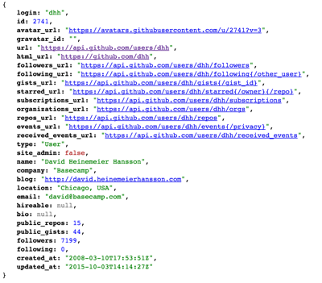
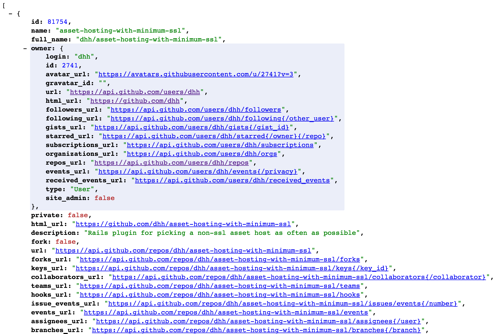

For me, APIs (application program interfaces) ~~are~~ were like Homer's island of Sirens - a beautiful sounding place where programmer happiness abounds but get to close and you'll die a thousand deaths by poor documentation and JSON (Javascript Object Notation) spaghetti. 

I was able to utilize a 3rd party API for one of my individual projects at General Assembly in conjunction with a data visualization library called HighCharts to extract basic data (number of alternative fuel stations by state) from NREL (the National Renewable Energy Laboratory), however, this project was done almost a year ago and since then I have been out of touch.

**This post is a first in a series I hope to write documenting the things I learn when re-familiarizing myself with the world of APIs, jQuery, AJAX and JSON.**

Let me begin with a simple premise: We should try to ***SEE*** the data we want to use. I found a great explanation provided by the GitHub API documentation [here](https://developer.github.com/guides/getting-started/). Basically, it takes a very babystepish approach to utilizing HTTP to retrieve JSON:

1. **Using cURL**. cURL is a command line tool that allows you to use the keyword *curl* in your terminal (Mac) to retrieve or send files/data from/to a server using URL syntax. See list of cURL commands [here](http://curl.haxx.se/docs/manpage.html).

2. When you use a *curl* command, it's like making a *GET* request from the server using HTTP.

3. E.g. If you're in the Terminal, type (replacing your GitHub username at the endpoint):

```curl https://api.github.com/users/yourGitHubUserName```

What you should see is a bunch of **JSON** with key, value pairs. This is the song the sirens sing. All JSON is is an *object* that represents something in *key* and *value* pairs. JSON objects can be nested within each other and this is where things can get confusing. For the purposes of this post, we are only concerned with familiarizing ourselves with how we can manipulate HTTP to retrieve data and what that data looks like.

*Footnote: If you don't want to use cURL, you can always enter the address into your browser to return the same results.*

The GitHub API is not only well documented but the JSON returned, is very well organized and clear, for example if you type in ```https://api.github.com/users/dhh``` you will see:



This info is all well and good but we want to see something more interesting. Let's try to see info on all of DHH's repos in his GitHub account. You'll see that there is a secondary layer we must go down... the line:

```repos_url: "https://api.github.com/users/dhh/repos",``` has a link that will get us where we need to go (I do not magically know this, but have figured it out based on a little common sense and a 10 year old's desire to play). Clicking here, we will see:



We now clearly see additional info on each of the repos belonging to the user DHH.

About a third of the way down, we see the following:

```languages_url: "https://api.github.com/repos/dhh/asset-hosting-with-minimum-ssl/languages",```

If we click here, we will see a nice, clean "languages" object showing us a key, value pair representing the langages used in that particular repo and the # of lines of code.


We've arrived on the island!


